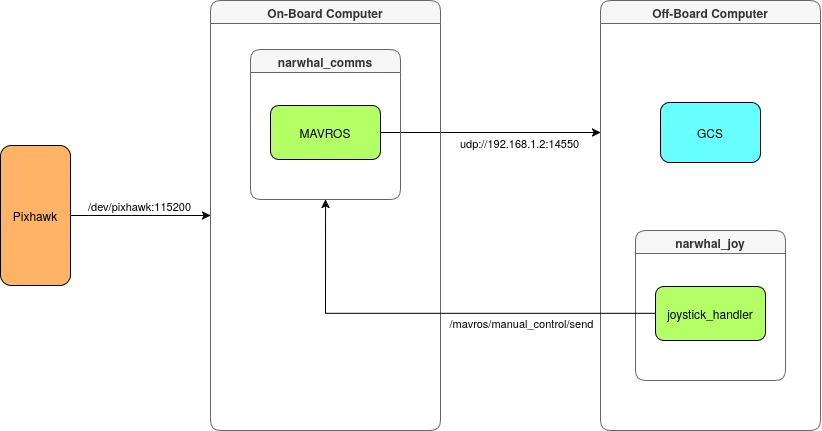

# Everything We do with MAVROS



MAVROS is ros2 package to bridge MAVLINK protocol to ros2 environment. Ardusub have many control mode available like MANUAL, STABILIZE, and ALT_HOLD that we can command from ROS2 environment. 

## Arming and Disarming

The process to Arming and Disarming is available trough ros2 service:

- Arming

    ```bash
    ros2 service call /mavros/cmd/arming mavros_msgs/srv/CommandBool "{value: true}"
    ```

- Disarming

    ```bash
    ros2 service call /mavros/cmd/arming mavros_msgs/srv/CommandBool "{value: false}"
    ```

## Changing Mode

- Manual

    ```bash
    ros2 service call /mavros/set_mode mavros_msgs/srv/SetMode "{base_mode: 0, custom_mode: 'MANUAL'}"
    ```

- Stabilize

    ```bash
    ros2 service call /mavros/set_mode mavros_msgs/srv/SetMode "{base_mode: 0, custom_mode: 'STABILIZE'}"
    ```

Just change the custom_mode value to the mode we want to change:

Available Modes:

- MANUAL
- ALT_HOLD
- STABILIZE
- DEPTH_HOLD
