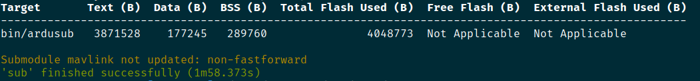

# Software in the LOOOOP

Softwar in the Loop or SITL in short term is our way to test the program like the control system safely in simulated environment. Narwhal use Gazebo Simulation ([gz sim](https://gazebosim.org/docs/latest/)) environment as it is the environment that support ROS2 directly. To extend the use of Ardusub in Gazebo, we need to use [ArduPilot plugin for Gazebo](https://github.com/ArduPilot/ardupilot_gazebo/). 

## Prerequisite

- [narwhal_ws](https://github.com/narwhal-auv/narwhal_ws/)
- [ArduPilot](https://github.com/ArduPilot/ardupilot/)
- ROS2 Humble or ROS2 Jazzy
- Gazebo Garden or Gazebo Harmonic
- Sanity in minds, wkwkw

## Installation

- Clone the [narwhal_ws](https://github.com/narwhal-auv/narwhal_ws/) and follow how to setup it in the readme section.
- Clone the [ArduPilot](https://github.com/ArduPilot/ardupilot/) repository and update the submodule.

    ```bash
    git submodule update --init --recursive --remote
    ```

    Setup the ArduPilot to use the SITL

    ```bash
    cd ArduPilot
    ```

    ```bash
    export CFLAGS="-Wno-error=unused-variable"
    ./waf configure --board sitl
    ./waf sub
    ```

    Successful build and compile process is indicated by `'sub' finished successfully`

    

- Install the dependencies stated in `ardupilot_gazebo` ([check here](https://github.com/ArduPilot/ardupilot_gazebo/#installation)). 
- Build all packages in narwhal_ws or you can also selecting the main packages used for SITL.

    ```bash
    colcon build --packages-select ardupilot_gazebo narwhal_simulation narwhal_comms
    ```

## Run

- Run the gz sim environment, we recreated the SAUVC competition field in the Gazebo environment and use BlueROV2 as the vehicle.

    ```bash
    ros2 launch narwhal_simulation sauvc.launch.py
    ```

    Wait until the Gazebo simulation is launched and finish its process.

- Run the ArduPilot SITL.

    Go to the top folder of ArduPilot, then ...

    ```bash
    Tools/autotest/sim_vehicle.py -v ArduSub -f vectored_6dof --console --map --model JSON -L RATBeach --out=udp:0.0.0.0:14550
    ```

- Run the narwhal_comms, used for MAVROS connection.

    ```bash
    ros2 launch narwhal_comms sitl.launch.py
    ```

- SITL is ready to use

    (optional) test it with simple [arming and disarming command](../docs/mavros.md) or to use ManualControl ([ManualControl](../docs/manual-control.md))